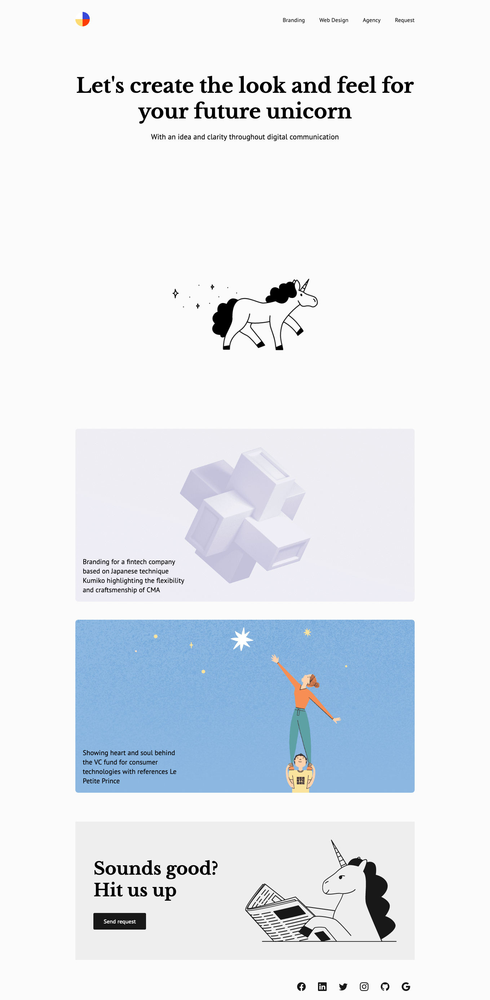

# Unicorn

## Spécifications

Couleurs :

```css
:root {
    --black: #181818;
    --white: #ffffff;
    --gray: #eeeeee;
    --gray-light: #fbfbfb;
    --font-body: 'PT Sans', sans-serif;
    --font-title: 'Libre Baskerville', serif;
}
```

Police de caractères :

```text
"Libre Baskerville" pour lms balises headings
"PT Sans" pour le document
```

Icônes :

Toutes les icônes se trouvent sur le site de Bootstrap :  
https://icons.getbootstrap.com/

## Notes

Aucune animation ou transition.  
Rien ne vous empêche d'en ajouter pour animer le template une fois celui-ci intégré.


# Preview



